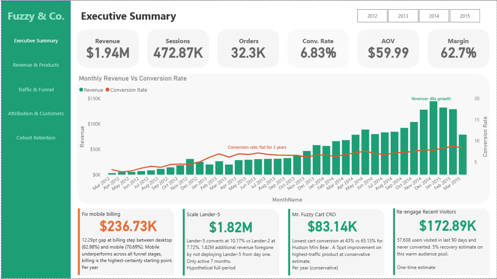

# Ecommerce Funnel Analysis -- Fuzzy & Co.

**End-to-end funnel audit identifying conversion leakage and revenue recovery opportunities across 472,871 sessions, 32,313 orders and 394,318 users (March 2012 -- March 2015)**

**Stack:** Python · SQL Server (T-SQL) · Power BI

---

## Executive Summary

Fuzzy & Co. grew revenue 48x in three years -- from under $3,000/month to over $140,000/month. But conversion rates remained flat throughout the entire period. The session-to-order rate never meaningfully improved, the core product funnel showed zero optimisation and the average converting user placed only 1.02 orders in their lifetime. All growth came from acquiring new customers. None came from converting them more efficiently.

This analysis quantifies four revenue recovery opportunities requiring zero increase in marketing spend:

| Recommendation | Estimated Impact |
|---|---|
| Scale Lander-5 (10.17% conversion rate) to all paid traffic | **$1.82M** foregone revenue |
| Fix mobile checkout -- 12.29pt billing gap vs desktop | **$236,730/year** |
| Optimise Mr. Fuzzy product page -- worst cart conversion at 43% | **$83,140/year** |
| Re-engage 57,638 recent non-converters within 90-day window | **$172,890** one-time |

All estimates apply a 50% conservative improvement factor. The Lander-5 figure is a historical calculation, not a projection -- no improvement factor applied. Full methodology in [`insights.md`](insights.md).

---

## Dashboard Preview



*Revenue bars climb 48x left to right. The flat orange line is the conversion rate. That gap is the business problem.*

---

## Business Problem

This ecommerce business faced a paradox: exceptional top-line growth masking zero improvement in conversion efficiency.

**The three questions this analysis answers:**

1. **Where is the funnel leaking?** Identify the specific steps, pages, products and traffic segments where the largest conversion losses occur and quantify the revenue impact of each gap.

2. **Where should marketing budget go?** Determine which traffic channels introduce and convert the highest-value customers and identify where attribution model choice is distorting the channel picture.

3. **Which products and landing pages deserve investment?** Compare product-level and landing page-level efficiency across conversion rate, revenue per session, and margin.

**Dataset scale:**

| Metric | Value |
|---|---|
| Sessions | 472,871 |
| Orders | 32,313 |
| Unique users | 394,318 |
| Non-converting users | 362,622 (91.96%) |
| Products | 4 |
| Landing pages | 6 |
| Traffic channels | 5 |
| Date range | March 19, 2012 -- March 19, 2015 |

---

## Methodology

**Python** -- Data loading, inspection and cleaning. Handled referential integrity checks, URL extraction, category dtype optimisation and cross-table price reconciliation. Produced 6 EDA visualisations and a cleaning summary.

**SQL Server (T-SQL)** -- Built 4 analytical views (session funnel, product page funnel, landing page/device segmentation, user-level attribution) and wrote analysis scripts covering all funnel dimensions. Fixed a fan-out bug in the attribution view using ROW_NUMBER() window functions to guarantee one row per user regardless of timestamp ties.

**Power BI** -- Built a 5-page interactive dashboard with page-level KPIs, conditional formatting highlighting problem areas and quantified recommendation cards. Data model uses a dedicated DATE_TABLE connected via a calculated Session Date column to resolve datetime mismatch issues across table relationships.

---

## Key Findings

**Revenue and Products**
- Mr. Fuzzy generates $1.21M in revenue but has the lowest margin at 61.01%. Hudson Mini Bear and Birthday Sugar Panda carry 68%+ margins but receive a fraction of the traffic.
- Birthday Sugar Panda has a 6.04% refund rate -- nearly 5x higher than Hudson Mini Bear's 1.28%.

**Product Funnel**
- Mr. Fuzzy converts only 43.04% of product page visitors to cart. Hudson Mini Bear converts 65.13% -- a 22 percentage point gap on the business's most trafficked product.
- Mr. Fuzzy's cart conversion showed zero directional improvement across all 36 months.

**Landing Pages**
- Lander-5 converts at 10.17% and generates $6.43/session -- best on every metric. It was active for only 7 of 36 months.
- After Lander-5 launched in August 2014, overall business conversion improved from 6.20% to 7.88% and revenue per session improved from $3.55 to $5.00.

**Device and Traffic**
- Mobile converts at 3.09% vs desktop at 8.50%. The gap concentrates at billing: 70.69% mobile vs 82.98% desktop -- a 12.29pt drop at the payment form after purchase intent is demonstrated at every prior stage.
- Desktop generates $5.09/session vs mobile's $1.87 -- a 2.7x gap.

**Attribution**
- Gsearch nonbrand introduced 86.24% of all converting customers on their first visit. It also closes the majority of sales in last-touch attribution -- both models agree nonbrand is the primary acquisition engine.
- 82.55% of buyers convert on their first session. Median days to convert is 0.
- 13.15% of converting customers switched channels before purchasing. The most common path: gsearch nonbrand introduces, organic or direct closes. Last-touch attributes the credit to the closing channel -- first-touch shows where the acquisition work was done.
- Average lifetime revenue per converting user is channel-independent: $60.59 to $64.92 across all channels. Channel determines acquisition probability, not downstream spend.

**Non-Converters**
- 362,622 users never purchased. 83.4% never reached the cart -- the bleed happens before checkout, not at it.
- 57,638 visited within the last 90 days -- the highest-priority retargeting pool.

**Retention**
- Month-1 cohort retention never exceeded 1.81% across 37 cohorts tracked over 3 years.
- Average orders per converting user: 1.02.

**Cross-Sell**
- 23.87% of orders contain two items. Average order value moves from $50.82 to $89.25 when a second item is added -- a 75.6% uplift.
- Hudson Mini Bear functions as the universal cross-sell item, appearing as the secondary product in three of the top four purchase pairs.

---

## Repository Structure

```
ecommerce-funnel-analysis/
|
|-- README.md                          <- You are here
|-- insights.md                        <- Full findings and recommendations
|
|-- data/
|   |-- website_sessions.csv
|   |-- website_pageviews.csv
|   |-- orders.csv
|   |-- order_items.csv
|   |-- order_item_refunds.csv
|   `-- products.csv
|
|-- python/
|   `-- Data_Loading_Inspection_and_Cleaning_v3.ipynb
|
|-- sql/
|   |-- 00_views_setup.sql             <- 4 analytical views (run first)
|   |-- 01_revenue_margin.sql
|   |-- 02_repeat_vs_new.sql
|   |-- 03_product_funnel.sql
|   |-- 04_landing_pages.sql
|   |-- 05_device_traffic.sql
|   |-- 06_attribution.sql
|   |-- 07_non_converters.sql
|   `-- 08_cross_sell.sql
|
|-- dashboard/
|   |-- FuzzyAndCo_EcommerceFunnelAnalysis.pbix
|   `-- screenshots/
|       `-- executive_summary.png
|
`-- docs/
    `-- data_dictionary.md
```

---

## Data

The six CSV files in `/data/` are the raw source tables loaded into SQL Server before any transformation. They match the schema described in `docs/data_dictionary.md`.

| File | Rows | Description |
|---|---|---|
| `website_sessions.csv` | 472,871 | One row per session with UTM, device, and user data |
| `website_pageviews.csv` | 1,188,124 | One row per pageview with URL and timestamp |
| `orders.csv` | 32,313 | One row per order with session, user, and price data |
| `order_items.csv` | 40,025 | One row per order line item with product and price |
| `order_item_refunds.csv` | 1,721 | One row per refund with amount |
| `products.csv` | 4 | Product catalogue with launch dates |


---

## How to Run

**Step 1 -- Python (data loading and cleaning)**
Open `python/Data_Loading_Inspection_and_Cleaning.ipynb` in Jupyter. Set `FUNNEL_DATA_PATH` to the `/data/` folder path. Run all cells to load, inspect and clean the six CSV files.

**Step 2 -- SQL Server (analysis)**
Import the cleaned data into SQL Server as tables matching the names in `docs/data_dictionary.md`. Run `sql/00_views_setup.sql` first to create the 4 analytical views. Then run analysis files `01` through `08` in any order.

**Step 3 -- Power BI (dashboard)**
Open `dashboard/FuzzyAndCo_EcommerceFunnelAnalysis.pbix` in Power BI Desktop. Update the data source connection to point to your SQL Server instance and refresh.

---

## Author

**Victoria Iyanu Owolabi**
Data analyst 

[LinkedIn](https://linkedin.com/in/victoria-iyanu) 

*Built and documented in public on LinkedIn -- follow the series for the analytical decisions, mistakes, and findings behind this project.*

